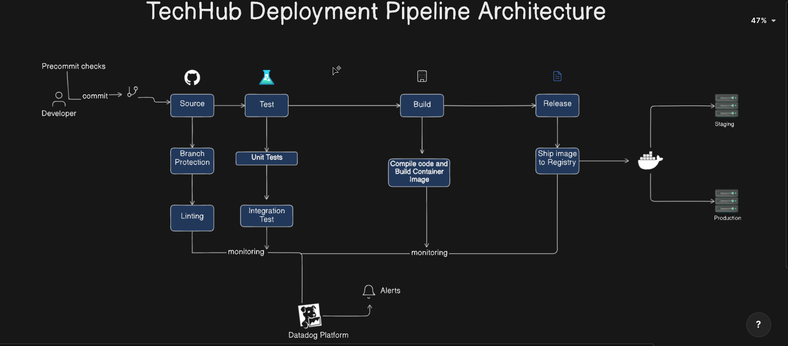

# TechHub

TechHub is an online platform that connects tech enthusiasts, offering resources such as articles, tutorials, and discussion forums on various technology topics. This repo is a POC for a deployment pipeline and architecture for the app.

## Architecture



The above diagram illustrates the deployment pipeline architecture for a continuous integration and continuous deployment (CI/CD) process for techhub.

The architecture has a number of components, lets break them down.

1. _**Developer**_: Initially the developer checks their code to version control, git in this case, and creates a commit. Before the commit object is created, pre-commit checks (hooks) are run on the developers side to validate linting standards and run tests, once all these are valid, the changes are pushed to an upstream repository (github in case) which will act as a source for the pipeline.

2. **_Source_**: At the source level, branch protection strategies have been setup, to ensure only changes that have been reviewed and approved end up in the main branch. This step ensures that certain rules or policies are enforced before merging code changes into main branch. Changes in the main branch will triger the pipeline and the next steps will be ran.

3. **_Test_**: Unit, integration and end to end tests will be ran in this stage and if they pass, the next stage, the build stage will be ran.

4. **_Build_**: If all the test pass, the dependencies are collected to build an artifact, in this case, a docker image.

5. _**Release**_: Finally the artifact (docker image) is pushed to a registry, docker hub in this case (although other container registries can be configured in this case, ECR, Artifact Registry, Azure Container Registry, etc). From where it can be deployed to different environments (staging, qa, production)

In all of the phases, datadog will be configured to monitor the process by gathering telemetry signals. From this, dashboards can be created for monitoring the process and creating alerts incase any of the phases breaks.

## Integration

To use the pipeline, follow these steps

1. ### Setting up hooks on the dev side
   copy the the files in the `hooks` directory to the `.git/hooks/` directory in the git repository

```shell
cp hooks/* .git/hooks/
```

2. ### Configuration github actions secrets
   Add the following secrets to the github repo

- _DOCKERHUB_USERNAME_ - username for docker (personal or org)
- _DOCKERHUB_TOKEN_ - docker hub tokken, you create create one by following the [docs](https://docs.docker.com/security/for-developers/access-tokens/)
- _SECRET_KEY_ - random string to act as a django secret key

3. ### Adding Obserability (monitoring and logging)
For monitoring the CI, you can configure datadog by following the [docs](https://www.datadoghq.com/blog/datadog-github-actions-ci-visibility/)